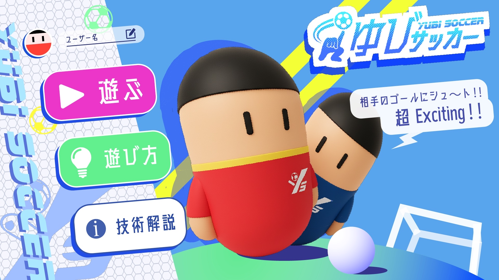

# 机上バーチャルサッカー

## 製品概要

### 背景(製品開発のきっかけ、課題等）

私たちは「直感的なインターフェース」を第一に追求しています。あくまで技術は手段であり、誰もが感覚的に遊べる体験を実現するための道具です。その一環として、“手で足を操る”という新しい操作体験に挑戦しました。カメラで指の動きを捉え、ゲーム入力へ自然につなげることで、遊びの敷居を下げることを目指しています。

一方で、リアルタイム対戦ゲームでは複数プレイヤー間の状態同期や遅延、スケーリングなどの課題が存在します。特にサッカーのように物理演算・衝突判定・位置同期が求められるゲームでは、高頻度な通信とサーバー間の状態共有が必要になります。

### 製品説明（具体的な製品の説明）

このプロダクトは「直感的な操作性」を徹底的に追求した、オンライン対戦型サッカーゲームです。従来のキーボード操作に加え、カメラを用いたハンドトラッキングによって、実際に“手を動かす”ことで選手を自在にコントロールできます。これにより、誰でも直感的にプレイでき、ゲーム初心者やお子様でもすぐに楽しめる体験を実現しています。

また、手の動きで足を操作するという“身体の使い方の再発明”に挑戦しており、この技術は他分野や他ツールへの応用も可能です。たとえば、リハビリや教育、バリアフリーなインターフェース開発など、さまざまな分野での活用が期待できます。

ゲームは最大4人まで同時参加でき、友人や家族とリアルタイムで対戦可能です。1試合は約3分で、短時間でも盛り上がる設計です。操作方法は、キーボード（矢印キー/WASD）またはハンドトラッキングから選択でき、どちらもシンプルなUIで切り替え可能です。

---

### 主な特徴

- 直感的なハンドトラッキング操作（MediaPipe Hands使用）
- キーボード操作にも対応
- 最大4人のオンライン対戦
- 1試合3分のカジュアル設計
- 友人・家族とすぐに遊べるシンプルUI
- 技術転用可能なインターフェース設計

---

このように、本プロダクトは「誰でもすぐに楽しめる直感的な操作体験」と「技術の多分野応用性」を両立した、新しいオンラインゲーム体験を提供します。

### 特長

#### 1. ラグを感じにくい対戦体験

- 選手やボールの動きが滑らかで、操作のタイミングが掴みやすい
- 競り合いや連携プレイが気持ちよく決まる

#### 2. インストール不要で今すぐ遊べる

- ブラウザでUR
Lを開くだけでOK（対応ブラウザ推奨）
- 指トラッキング対応端末なら、カメラを使った直感操作も選べます

#### 3. 友だちとすぐ合流できる

- 「クイックマッチ」で自動参加
- 「プライベートルーム」で招待して身内対戦

### 解決出来ること

- 誰もが使いやすい直感的なインターフェース
- リアルタイム対戦ゲームのサーバー構成・状態同期の実装パターンを提供
- WebSocketとREST APIを組み合わせた、スケーラブルなマルチプレイヤーゲームの基盤
- Docker + モノレポによる、開発・デプロイ環境の一貫性とメンテナンス性の向上

### 今後の展望

このアプリ自体の完成度をさらに高めていくことはもちろん、ハンドトラッキング技術を他の分野やツールにも応用し、より多くの人が使いやすいインターフェースを追求していくことも今後の大きな目標です。たとえば、リハビリや教育、バリアフリーなUI開発など、さまざまな領域での展開を視野に入れています。

- AI対戦相手の実装（プレイヤー不足時の自動補完）
- ランキング・リーダーボード機能の拡充
- モバイル対応UI・タッチ操作の最適化
- トーナメント・リーグ戦モードの追加

### 注力したこと（こだわり等）

- Docker ComposeとWorkspacesによる、ローカル開発からコンテナ環境まで一貫した依存解決と起動フロー
- WebSocketによる高頻度tick配信（50ms）と、Redisを用いた複数サーバー間の位置情報同期の実装
- クラウド未経験からの CI/CD 構築（Cloud Build → Artifact Registry → Cloud Run の自動ビルド・デプロイ）

## 開発技術

### 活用した技術

#### API・データ

- PostgreSQL: 試合結果・プレイヤー統計の永続化
- Redis: 複数サーバーインスタンス間のプレイヤー位置情報共有

#### フレームワーク・ライブラリ・モジュール

- **フロントエンド**: Three.js (3Dレンダリング), ES Modules (CDN: jsdelivr)
- **バックエンド**: Node.js 20, Express 4, ws (WebSocket), pg (PostgreSQL), redis 4
- **インフラ**: Docker Compose, npm workspaces, Google Cloud（Cloud Build, Artifact Registry, Cloud Run）

CI/CD（概要）

- フロー: `git push` → Cloud Build で Docker ビルド → Artifact Registry に push → Cloud Run へデプロイ
- ポイント:
  - Cloud Run は `PORT=8080` / `0.0.0.0` での待受けが必須（本リポジトリは対応済み）
  - ヘルスチェックに `/health` を使用可能
  - ビルドコンテキストはサービスごと（backend 単体は `backend/` を利用）
  - 失敗時は Cloud Run の起動ログ（[BOOT]/[FATAL]）で一次切り分け

構成要素（技術）

- フロントエンド（`frontend/`）
  - ゲーム: `frontend/Game/Game/index.html`
  - 指トラッキング: `frontend/FingerTracking/index.html`（HTTPS 環境でカメラ利用）
  - `frontend/Dockerfile`: nginx で `Game/` と `FingerTracking/` を配信
- バックエンド（`backend/`）
  - `server.js`: Express + WebSocket。ヘルス `GET /health`、統計 `GET /api/stats`
  - WebSocket 接続・メッセージ処理: `websocket/WebSocketManager.js`
- データベース（`db/`）
  - PostgreSQL 初期化スキーマ: `schema.sql`
- キャッシュ/同期
  - Redis（プレイヤー状態やイベント連携に使用）

#### デバイス

- モダンブラウザ（WebGL2対応）
- 自分の指！

### 独自技術

#### ハッカソンで開発した独自機能・技術

- リアルタイム同期サーバー（WebSocket + Redis連携による複数インスタンス対応）
  - WebSocket接続/メッセージ処理: [backend/websocket/WebSocketManager.js](backend/websocket/WebSocketManager.js)
  - Redisサービス: [backend/services/RedisService.js](backend/services/RedisService.js)
- Three.jsによる3Dゲームロジックとプレゼンテーション層の分離（MVP パターン）
  - [frontend/Game/Game/Match.js](frontend/Game/Game/Match.js)
  - [frontend/Game/Player/](frontend/Game/Player/)
- Docker + npm workspaces によるモノレポ構成とコンテナ化
  - [backend/Dockerfile](backend/Dockerfile)
  - [docker-compose.yml](docker-compose.yml)

補足（ポート/エンドポイント/ワークスペース）

- Docker Compose 起動時の既定公開先
  - Frontend: <http://localhost:8080/>
  - Backend: <http://localhost:3000/>（`/health` あり、WebSocketも同ポート）
  - PostgreSQL: localhost:5432（user: postgres / pass: postgres / db: soccer_game）
  - Redis: localhost:6379
- ルートの `package.json` で `workspaces: ["backend", "db"]` を定義
- Cloud Run 等でのバックエンド運用時は `PORT=8080` / `0.0.0.0` で待受け（実装済み）。ヘルスチェックに `/health` を利用可能。
